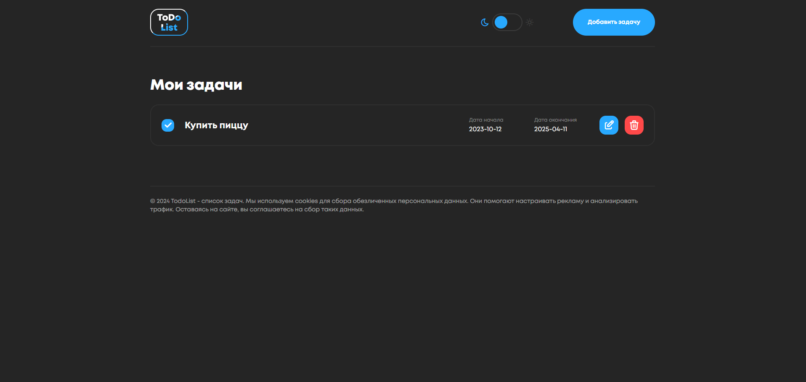
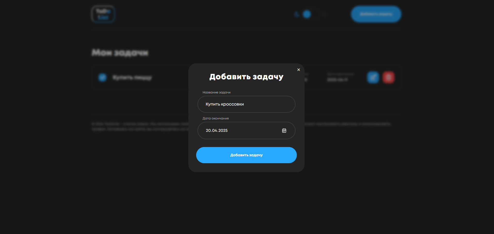
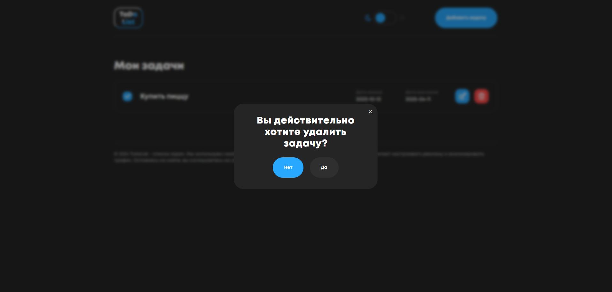

# ToDo-List Vanilla JS 🚀
[](https://nvyaznikov.github.io/todo-list/)

## 📸 Скриншоты интерфейса

<details>
<summary>🔍 Развернуть скриншоты</summary>

<div style="display: flex; overflow-x: auto; gap: 10px;">
  
  
  
  
</div>

</details>

Простой менеджер задач.

## 🔥 Особенности

- **CRUD-операции** с задачами (добавление, редактирование, удаление, отметка выполнения)
- **Local Storage** (данные сохраняются после перезагрузки)

## 🛠 Технологии

- **HTML5** (семантика)
- **CSS3** (Flexbox, кастомные свойства)
- **JavaScript ES6+** (JS Vanilla)
- **LocalStorage API** (сохранение данных)

## 🏗 Структура проекта
```text
todo-list/
│
├── css/                        # Все CSS-стили
│   └── style.css               # Основной файл стилей
│   └── сommon.css              # Общий файл стилей
│   └── tabler-icons.min.css    # Миним.версия Tabler Icons
│
├── js/                         # JavaScript-логика
│   └── main.js                 # Главный скрипт приложения
│
├── img/                        # Все Image
│   ├── calendar-black.svg      # Темная версия календаря
│   ├── calendar.svg            # Светлая версия календаря
│
├── fonts/                      # Шрифты Mont
│   ├── Mont-regular.woff
│   └── Mont-bold.woff2
|   .....
│
├── index.html                  # Главная страница
└── README.md                   # Документация
```
## 🚀 Быстрый старт

1. Клонируйте репозиторий:
```bash

git clone https://github.com/nvyaznikov/todo-list.git
cd todo-list
```
2. Либо перейдите по ссылке: 
[ToDo-List](https://nvyaznikov.github.io/todo-list/)
